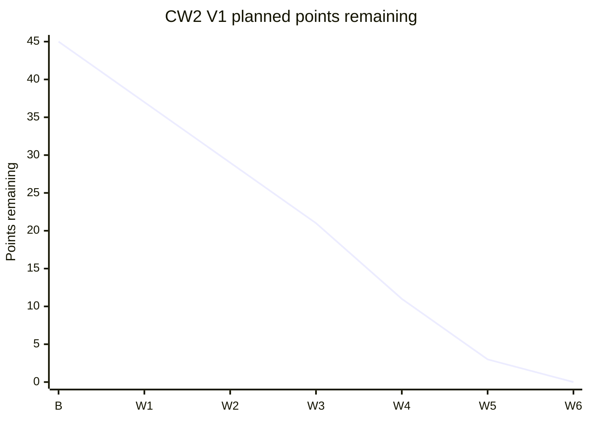

# Crusader Wars 2: V1 burndown

Baseline: 2026-09-23. Goal: one CK3 encounter exported to a playable battle
using **vanilla Three Kingdoms units**, with the result safely returned to CK3
through a save/restart workflow. See the [codebase map](CODEBASE_MAP.md) and
[project brief](../4ead3b48-2348-46cf-8eba-3d49e5441a5b_WarHammer_World.pdf).

`dev/` contained no port source at baseline. The estimates below are a **planning
assumption**, not hours, a delivery promise, or evidence that work elsewhere is
unfinished. The PDF's progress percentages are design discussion, not verified
completion of these tasks. Rebaseline when the current port code is available.

## Gated backlog

| ID | Deliverable | Points | Acceptance evidence |
| --- | --- | ---: | --- |
| G1 | 3K staging and survivor spike — complete under revised scope | 8 | Generated vanilla rosters reach a playable battle without manual roster rebuilding; surviving soldier counts remain attributable to both sides. Verified by the Records run. |
| G2 | CK3 write-back spike | 8 | A synthetic result applied to a disposable save survives reload/time advance, resolves the battle once, and rejects a second application. |
| E1 | CK3 encounter extractor | 5 | A real fixture produces participating army IDs, sides, starting strengths, prowess source, and save fingerprint. |
| M1 | Versioned battle manifest | 3 | Validated file carries source army identity, initial strengths, side, prowess, seed, and result correlation ID; invalid input fails closed. |
| R1 | Vanilla 3K catalog and roster roll | 5 | Unit IDs are verified in the target game; seeded prowess-biased rolls produce legal reproducible rosters without Attila assets or mapper XML. |
| R2 | Shared scaling and allies | 5 | Both sides use one size scale within 3K limits; allied proportions and original CK3 army IDs survive any blending. |
| I1 | One complete round-trip | 8 | One exported CK3 encounter runs in 3K and returns attributable casualties and authoritative outcome; retries or a wrong save cannot corrupt CK3. Includes G1-H1 winner export and a changed-unit repeat. |
| P1 | Reproducible operator runbook | 3 | Setup, manual steps, error recovery, and one clean-room demo are documented and repeatable. |
| | **Total provisional scope** | **45** | |

**Gate rule:** if G1 cannot extract results, or G2 cannot resolve an active CK3
battle safely, stop and revise the design before building out the roster mapper.
Do not assume a 3K battle XML, Lua result hook, or direct save edit is supported
until the corresponding spike proves it.

## Planned burn (illustrative weekly checkpoints)

**Current checkpoint: 37 points remaining. G2 is active.** On the user's
G1 → G2 transition request, G1's scope was explicitly narrowed to staging and
attributed survivor capture. This does not mean the original outcome requirement
passed: winner export (`G1-H1`) and the changed-unit repeat move into I1 as
mandatory acceptance checks, not optional hardening. Total remains 45; G1's
8 points are complete under this revised allocation. Earlier entries below
retain their historical status and are superseded by this checkpoint.

G2 progress: existing disposable save copied and hash-verified; combat
`2717908992`, its two armies and 15 army-regiment records identified. Synthetic
38/75-loss plan prepared. Three preflight tests pass. No patched save or
reload/time-advance proof yet; G2 remains 0/8.

G2 artifact audit: an externally generated AFTER save was rejected after
comparison showed combat-only edits, unchanged backing army/regiment tables,
and no implemented outcome resolution. The unsafe apply entry point is now
fail-closed. G2 remains open; no additional points are complete.

| Checkpoint | Suggested work completed | Ideal remaining | Verified remaining |
| --- | --- | ---: | ---: |
| B (2026-09-23) | None verified in `dev/` | 45 | 45* |
| W1 | G1 | 37 | TBD |
| W2 | G2 | 29 | TBD |
| W3 | E1, M1 | 21 | TBD |
| W4 | R1, R2 | 11 | TBD |
| W5 | I1 | 3 | TBD |
| W6 | P1 | 0 | TBD |

*45 is the unverified **local** scope at baseline, not a statement about work
already done outside this folder. W1-W6 are proposed weekly checkpoints with no
committed dates or established velocity; the chart plots **ideal only**. Add an
actual series only after a real checkpoint, and leave future actuals blank.

G1 evidence update (2026-09-23): [native historical XML and battle Lua
interfaces](spikes/g1_3k_io/evidence/native_findings.md) found in `data.pack`.
A [double-click probe and runbook](spikes/g1_3k_io/RUNBOOK.md) now generate a
two-file mod and validate correlated soldier-count logs. Local tooling tests
pass; a real battle and result comparison remain pending. G1 is still 0/8;
verified remaining stays at 45. G1 acceptance is clarified to require external
staging now, rather than defer that feasibility question to I1. Scope unchanged.

Live update: Records deployment on build 25370317 loaded both generated armies.
Six unit identities and initial soldier counts match the manifest (181 per
side); the native logger emitted start/deployed events. Final outcome and
survivors remain pending, so no complete G1 points are burned yet.

Completed-fight update: exported `complete` counts match the operator's result
screen (attacker 143, defender 106 survivors). Winner is visually confirmed as
attacker victory, but the machine-readable result callback did not fire.
G1 remains open specifically for winner export and the changed-unit repeat;
verified remaining is still 45. Do not treat this log as a CK3-applicable result.

At each checkpoint, mark a deliverable complete only with its acceptance
evidence, then set verified remaining to the sum of incomplete points. Record
scope changes separately and redraw the ideal line when the baseline changes.
Optional MaA archetypes, historical/cultural mapping, terrain selection,
reinforcement waves, and an Attila target are outside this V1 estimate.
