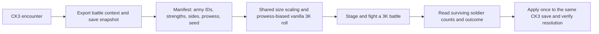

# Crusader Wars 2: codebase map

`dev/` contains a G1 native battle generator, Lua logger, result validator and
double-click probe as of 2026-09-23. Full CK3 integration is not implemented.
The deprecated Attila-era Crusader Wars 1.4.2 installation was removed from the
workspace on 2026-09-23; only curated text fixtures survive in the git-ignored
`reference/` (bulk logs and the raw 208 MB gamestate dump were dropped with it).
This document separates observed files from proposed
3K components.

## Sources and boundaries

| Surface | Evidence | Status for CW2 |
| --- | --- | --- |
| Project scope | [WarHammer World brief](../4ead3b48-2348-46cf-8eba-3d49e5441a5b_WarHammer_World.pdf), especially its final boundary-first build order | Design input, not proof that any integration works. |
| CK3 battle context | [Battle scripted GUI](reference/cw1/ck3%20mod/Crusader%20Wars/common/scripted_guis/01_battle_info.txt) emits a `CRUSADERWARS3` marker, participant and army IDs, and commander/knight `PROWESS` through `debug_log` | Available reference; the CW2 parser is not present. |
| CK3 army state | [army-regiment extract](reference/cw1/data/save%20file/ArmyRegiments.txt) with sibling section extracts (Armies, Regiments, Units, Combats, BattleResults, Wars); the `edited/` folder shows the legacy write-back. The raw `gamestate` dump was deleted 2026-09-23 to reclaim space. | Fixtures for identities and starting strengths; current CW2 extraction is unverified. |
| Legacy units and engine | [Attila unit mapper](reference/unit_mappers/OfficialCW_HighMedieval_MK1212Mod/Factions/OfficialCW_HighMedieval_MK1212Mod_Units.xml) and [Attila schema](reference/cw1/attila/schema_att.ron) | Reference only; no Attila asset IDs or mappings in the V1 3K roster. |
| 3K backend | Installed build `25370317`; [native XML and Lua evidence](spikes/g1_3k_io/evidence/native_findings.md) and [completed Records run](spikes/g1_3k_io/evidence/records_completed_observed.json) | Generated armies and 143/106 survivors verified in-game. The result callback did not export the winner; a changed-unit repeat remains for integration. |
| CK3 return path | G2 save intake and synthetic plan exist; the first AFTER artifact [failed audit](spikes/g2_ck3_writeback/evidence/AFTER_SAVE_REVIEW.md) | No engine-verified write-back or externally resolved CK3 battle. Second feasibility gate remains open. |

## Proposed V1 flow

CK3 reference inputs, native 3K historical roster XML, script-name access,
and soldier-count methods are observed locally. A real G1 run proved the staged
roster and attributable survivor counts; machine-readable victory, general
roster limits and CK3 resolution remain **unproven**.
The probe uses installed 3K XML as its source, not an assumed Attila format.

## Implemented G1 experiment

- [probe.py](spikes/g1_3k_io/probe.py): native XML cloning, pack build/install/
  removal, run manifest and strict runtime-log validation.
- [probe.lua](spikes/g1_3k_io/probe.lua): initial/final soldier snapshots,
  unique script names and player-result callback.
- [probe_app.py](spikes/g1_3k_io/probe_app.py): Windows operator UI, packaged by
  [build_probe.ps1](build_probe.ps1) as `dist/CW2-G1-Probe.exe`.
- [test_probe.py](spikes/g1_3k_io/test_probe.py) and
  [test_lua.py](spikes/g1_3k_io/test_lua.py): negative result validation and
  Lua 5.1 mock-runtime checks. [Live runbook](spikes/g1_3k_io/RUNBOOK.md).

## Battle math (pure, no game needed)

- [battle_math/](battle_math/): [scale.py](battle_math/scale.py) stages both
  sides at one shared scale (1 : 1 up to 1,503 men a side, fewest generals,
  trim to exact strength); [result_to_ck3.py](battle_math/result_to_ck3.py)
  carries 3K casualty rates back to CK3 men per side. Regiment splits stay in
  the G2 patcher. Rule and examples:
  [bridge blueprint](../docs/design/cw2_bridge_blueprint.html#army).

## Planned production ownership (G1 probe is separate)

G2 now has [save intake and synthetic-result preflight](spikes/g2_ck3_writeback/patcher/preflight.py).
It preserves and fingerprints an existing archive, inventories active combats,
and binds a 38/75-loss plan to combat `2717908992`. Save mutation and engine
reload verification are still pending; this is not the production extractor.

| Interface | Future owner | Minimum contract |
| --- | --- | --- |
| CK3 -> manifest | `ck3_extractor` | Battle/army identities, sides, starting strengths, prowess source and source-save fingerprint. |
| Manifest -> 3K | `roster_engine`, then `three_kingdoms_adapter` | Shared size scale and deterministic vanilla-unit choices; *only after G1 proves a launch path*. |
| 3K -> result | `result_reader` | Winner plus starting/surviving soldiers correlated to the launched armies; *only after G1 proves access*. |
| Result -> CK3 | `ck3_applicator` | Check source-save fingerprint, encounter and result identity; apply losses and resolve once, with a durable duplicate guard. |

`BattleManifest` and `BattleResult` are proposed versioned file contracts, not
current on-disk game formats. Carry `save_fingerprint`, `encounter_id`, `seed`,
`side` and `source_army_ids` through the manifest; a result adds a unique
`result_id` tied back to that encounter. The CK3 and 3K adapters do not parse
each other's native files.

V1 follows the current design: participating CK3 army sizes determine relative
force size; prowess biases random selection from native 3K units. Preserve CK3
army IDs and a source-save fingerprint so a result can be attributed and not
applied twice. Decide whose prowess to use and how to seed rolls when the port
source and a battle fixture are available. The PDF also explores Men-at-Arms
archetypes, commander traits, terrain, and dual-engine support; these are
**later options**, not prerequisites for the first playable round-trip.

## First evidence to collect

1. Capture the 3K engine's winner and repeat with one changed unit. Staging and
   survivor counts work; neither remaining check should be inferred from them.
2. On a disposable CK3 save, apply a synthetic result, reload, advance time,
   and verify losses persist, the battle resolves once, and replay is rejected.
3. After both gates pass, promote the proven probe interfaces into the planned
   production modules and complete the CK3-to-3K round trip.

See [the burndown](BURNDOWN.md) for the gated backlog and tracking baseline.
